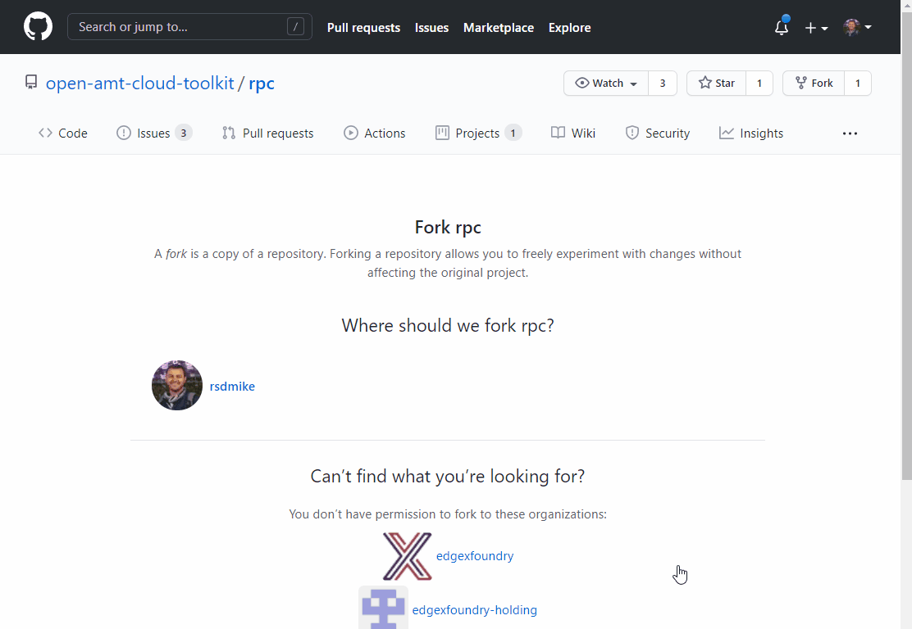

# Remote Provisioning Client

> Disclaimer: Production viable releases are tagged and listed under 'Releases'.  All other check-ins should be considered 'in-development' and should not be used in production

The Remote Provisioning Client (RPC) is an application that enables remote capabilities for Intel® AMT, such as as device activation and configuration. To accomplish this, RPC communicates with the Remote Provisioning Server (RPS) to activate and connect the edge device.

**For detailed documentation** about RPC or other features of the Open AMT Cloud Toolkit, see the [docs](https://open-amt-cloud-toolkit.github.io/docs/).

## Prerequisites

We leverage GitHub Actions as a means to build RPC automatically leveraging Github's CI/CD Infrastructure. This avoids having to deal with the challenges of getting your build environment just right on your local machine and allows you to get up and running much faster. Read more about GitHub Actions [here](https://github.blog/2019-08-08-github-actions-now-supports-ci-cd/#:~:text=GitHub%20Actions%20is%20an%20API,every%20step%20along%20the%20way.)

## Build the Remote Provisioning Client (RPC)

1. Create a fork of the rpc repository [here](https://github.com/open-amt-cloud-toolkit/rpc/fork) or via the Fork button in the top-right corner of the rpc repository.

2. Click on "Actions" and Select "Build RPC (Native)" Workflow.

3. Click "Run Workflow", select branch "master", and click "Run Workflow".

4. Grab a coffee. The build for Windows will take approximately 30 minutes and the build for Linux will take approximately 5 minutes.

5. Once complete, click the completed job, and download the appropriate RPC for your OS under the "Artifacts" section.

For detailed documentation about RPC and using it to activate a device, see the [docs](https://open-amt-cloud-toolkit.github.io/docs/)
